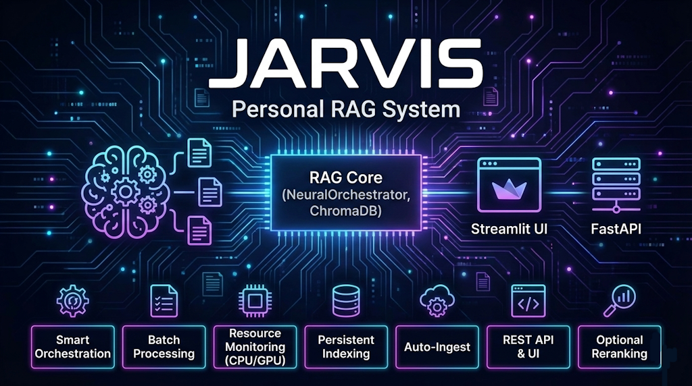

# JARVIS — Sistema RAG Personal



JARVIS es un sistema de Recuperación Aumentada por Generación (RAG) pensado para uso personal. Ingresa documentos, los trocea en fragmentos, genera embeddings, los indexa en ChromaDB y expone un backend FastAPI junto con una interfaz en Streamlit para consultar tu conocimiento.

## Características

- Orquestación inteligente con `NeuralOrchestrator` y colas por tipo de tarea
- Procesamiento por lotes con control de tiempo y tamaño
- Monitorización dinámica de recursos CPU/GPU y ajuste de capacidad
- Indexación persistente en `ChromaDB` (DuckDB + Parquet)
- Ingesta automática de ficheros mediante `watchdog`
- API REST con FastAPI y UI en Streamlit
- Reranking opcional con modelos tipo cross‑encoder

## Estructura

```
JARVIS/
├─ api/
│  └─ endpoints.py            # Rutas FastAPI (REST)
├─ core/
│  └─ orchestrator.py         # Orquestación, colas y workers
├─ database/
│  └─ chroma_db.py            # Gestor de ChromaDB
├─ ingestion/
│  ├─ extractors.py           # Extracción y troceado básico
│  └─ watchdog.py             # Observador de directorio de datos
├─ models/
│  └─ data_models.py          # Dataclasses de Document y SmartChunk
├─ config.py                  # Paths y configuración de modelos
├─ requirements.txt           # Dependencias del proyecto
├─ main.py                    # App FastAPI + arranque de servicios
└─ streamlit_app.py           # Interfaz Streamlit
```

Referencias clave del código:

- `core/orchestrator.py:194` clase `NeuralOrchestrator`
- `core/orchestrator.py:217-223` definición de colas por `TaskType`
- `core/orchestrator.py:574-584` arranque de workers
- `core/orchestrator.py:585-591` monitor de recursos
- `core/orchestrator.py:559-573` método `query`
- `database/chroma_db.py:10-23` inicialización de `ChromaDBManager`
- `ingestion/extractors.py:11-21` `DocumentExtractor` y formatos soportados

## Requisitos

- `python` 3.12 (el proyecto fija `3.12.4` en `requirements.txt`)
- Windows, Linux o macOS
- Opcional: GPU NVIDIA + `pynvml` y `torch` para acelerar embeddings

## Instalación

1. Crear entorno virtual (Windows):
   
   ```powershell
   python -m venv venv
   .\venv\Scripts\activate
   ```

   En Linux/macOS:
   
   ```bash
   python3 -m venv venv
   source venv/bin/activate
   ```

2. Instalar dependencias:
   
   ```bash
   pip install -r requirements.txt
   ```

3. Estructura de datos y almacenamiento:
   
   - Los directorios `data/`, `uploads/` y `chroma_db/` se crean automáticamente (ver `config.py`).

## Arranque

### Backend FastAPI

```bash
uvicorn main:app --reload --host 0.0.0.0 --port 8000
```

- Salud: `GET http://localhost:8000/health`
- API base: `http://localhost:8000/api/v1`

### Interfaz Streamlit

```bash
streamlit run streamlit_app.py
```

La UI llama al backend en `http://localhost:8000/api/v1`.

### App de Escritorio (PySide6)

```bash
pip install PySide6
python gui/app.py
```

La app envía consultas a `POST /api/v1/chat` y muestra respuesta y citas.

#### Streaming, Historial, Mic y TTS

- Streaming: usa `POST /api/v1/chat-stream` para recibir respuesta por partes.
- Historial: sesiones persistidas en `data/history.db` (SQLite).
- Micrófono (rápido): `SpeechRecognition` (Google Web Speech) si está disponible.
- Micrófono (local): Whisper (opcional). Instalar:
  - `pip install openai-whisper`
  - `pip install torch --index-url https://download.pytorch.org/whl/cpu`
  - Requisitos: `ffmpeg` en el sistema.
- TTS: `pyttsx3` (offline, SAPI en Windows).

## Uso rápido

- Añadir documento para procesar:

```bash
curl -X POST http://localhost:8000/api/v1/add-document \
  -H "Content-Type: application/json" \
  -d '{"path": "./data/mi_documento.pdf"}'
```

- Consulta semántica:

```bash
curl -X POST http://localhost:8000/api/v1/query \
  -H "Content-Type: application/json" \
  -d '{"query": "principales métricas", "top_k": 10}'
```

- Observador de archivos: coloca documentos en `./data/` para ingesta automática.

## Configuración de modelos

- Embeddings: `all-MiniLM-L6-v2` (`config.py:17-18`)
- LLM (opcional): `google/gemma-2b` (`config.py:19`)
- Reranker: `cross-encoder/ms-marco-MiniLM-L-6-v2` (`config.py:20`)
- Parámetros: `BATCH_SIZE`, `MAX_WORKERS`, `CHUNK_SIZE`, `CHUNK_OVERLAP` (`config.py:23-26`)

## Notas importantes

- Inyección de dependencias: `NeuralOrchestrator` requiere instancias de `ChromaDBManager` y `DocumentExtractor`.
  Si ves un error al arrancar por el constructor, inicializa así:

  ```python
  from database.chroma_db import ChromaDBManager
  from ingestion.extractors import DocumentExtractor
  orchestrator = NeuralOrchestrator(ChromaDBManager(), DocumentExtractor())
  ```

  Esto aplica tanto en `main.py` como en `api/endpoints.py`.

- Dependencias de API: asegúrate de tener `pydantic` (FastAPI lo instala) y de importar `time` y `typing.Dict` si los usas en `api/endpoints.py`.

- GPU: si hay GPU NVIDIA y `pynvml` disponible, el orquestador ajusta capacidad de embeddings y usa GPU cuando los umbrales de uso lo permiten.

## Desarrollo

- Logs: el orquestador usa `logging` y muestra estado periódico de tareas y recursos.
- Persistencia: ChromaDB guarda embeddings y metadatos (`database/chroma_db.py`).
- Extensibilidad: puedes cambiar el splitter de texto en `ingestion/extractors.py` y los modelos en `config.py`.

## Extras Opcionales

- Reranking avanzado (CPU):
  - `pip install transformers`
  - `pip install torch --index-url https://download.pytorch.org/whl/cpu`
  - En `core/orchestrator.py` el `Reranker` usa `AutoModelForSequenceClassification` y `AutoTokenizer`.

- Aceleración GPU (NVIDIA):
  - `pip install torch --index-url https://download.pytorch.org/whl/cu118`
  - `pip install nvidia-ml-py3` (pynvml)
  - El orquestador detecta GPU y ajusta capacidad de embeddings automáticamente.

- LoRA/PEFT (opcional):
  - `pip install peft bitsandbytes`
  - `LoRAManager` en `core/orchestrator.py` permite aplicar y conmutar adaptadores.

- Embeddings ligeros en CPU (mmh3):
  - Por qué: genera embeddings deterministas y ligeros sin modelos pesados. Se usa para mapear tokens a un vector de `384` dimensiones mediante hashing, útil cuando no hay GPU o no quieres instalar modelos de embeddings.
  - Dónde se usa: `cpu_batch_embedding` en `core/orchestrator.py:510-536`. Si `mmh3` no está disponible, el código hace fallback y devuelve vectores nulos, lo que empeora la recuperación.
  - Instalación (Windows, dentro del entorno virtual):
    - `h:\users\xpite\Desktop\JARVIS\venv\Scripts\python.exe -m pip install mmh3`
    - Alternativas: `pip install mmh3` o `python -m pip install mmh3`
  - Nota: tras instalarlo, los embeddings de CPU dejarán de ser todos ceros y la indexación en ChromaDB será efectiva para búsquedas semánticas básicas.

- Nota sobre ChromaDB:
  - Si usas versiones 1.x, `chromadb.PersistentClient` es la forma recomendada de cliente persistente.
  - La implementación actual usa `chromadb.Client(Settings(...))` y funciona con la versión indicada.

## Licencia

No se ha definido una licencia explícita en el repositorio.
